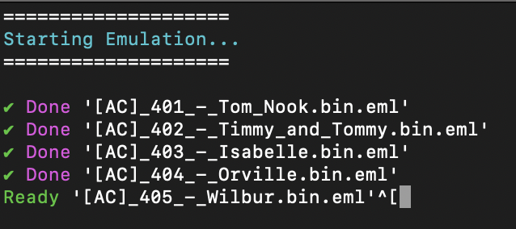

# Amiibo Conversion Scripts

This repository contains a Bash script designed to convert Amiibo files and execute Proxmark3 commands. This script facilitate the process of formatting the Amiibo binary files (.bin) and emulating them using Proxmark3.



## Contents

1. [Scripts](#scripts)
2. [Usage](#usage)
3. [Prerequisites](#prerequisites)
4. [Instructions](#instructions)
5. [Contributing](#contributing)
6. [License](#license)

## Script
### 2. `amiiboPM3.sh`

This script automates the execution of Proxmark3 commands on a batch of .bin files. It takes an input directory of .bin files or the direct path do a single .bin file, executes Proxmark3 commands on each file, and provides status updates. Press the physical button on the device to skip to the next Amiibo. The script will check the whole directory for .bin files and then emulate them in order.

## Usage
### `amiiboPM3.sh`

```
bash amiiboPM3.sh </path/to/.bin/directory or /path/to/.bin>
```

## Prerequisites

- Proxmark3 installed on your system
- Input Amiibo files in binary format (.bin)

## Instructions

- Ensure Proxmark3 is properly installed and accessible in your environment.
- Edit the Proxmark3 file paths in each script.
- Place the Amiibo binary files in a specified directory.  
- Use amiiboPM3.sh to automate the execution of Proxmark3 commands on the .bin files.  
- Press the button on the side of the PM3 to emulate the next Amiibo (green light - ready).  
 
## Contributing

Contributions are welcome! If you find any issues or have suggestions for improvements, please open an issue or create a pull request.

## License

This project is licensed under the MIT License.
